# Installing qs-governance-collector using the installer

### **[Download the latest installer from here](https://s3.amazonaws.com/eapowertools/governance-collector/bin/qs-governance-collector.exe)**

1. Save the installer to a location of your choosing.

2. Execute the installer by right clicking on the file and selecting run as Administrator.   
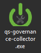

3. The welcome screen appears.  Click the Next button.   
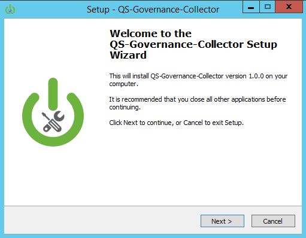

4. The license agreement appears.  Please take a moment to review the license.  Choose I accept and click the Next button.   
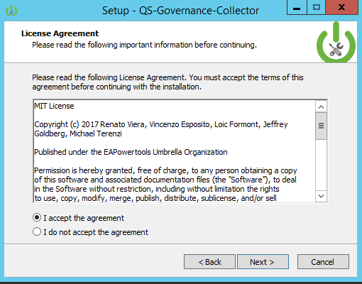

5. Before clicking Next when the select destination location screen appears, verify the following:    
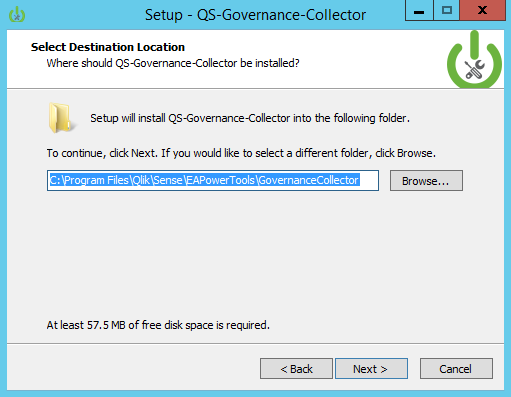

> If the EA Powertools Service Dispatcher is already installed, verify the path of the PowertoolsServiceDispatcher folder (*default:%programfiles%\qlik\sense\eapowertools\powertoolsservicedispatcher*).  Install the governance collector in an adjacent location to this folder (*eg: %programfiles%\qlik\sense\eapowertools\governancecollector*)

> If the EA Powertools Service Dispatcher is **not** installed, keep the default installation path or change to an alternative location.  The Powertools Service Dispatcher will be installed alongside the governance collector.   

6. Review the installation path and click the Install button to place the files on the destination system.    

7. After files for the governance collector have been placed on the system, the install scripts dialog will appear.  Click the Next button to commence the installation.    
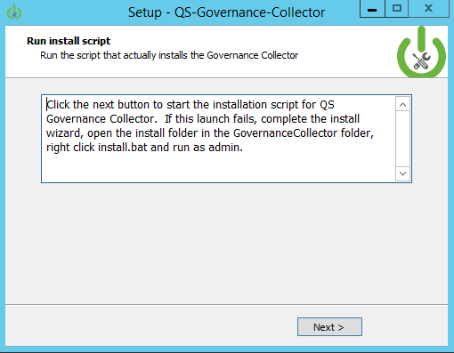

8. A command window appears to perform a DOS based installation of the governance collector.  A pre-check performed on the install is making sure the Powertools Service Dispatcher service is stopped.  To begin the installation type *y* or press the enter key.    
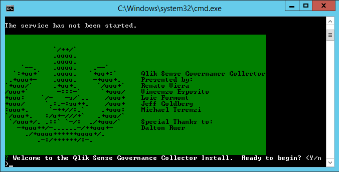

9. The governance collector installation has three modes:
    * **complete** installs the web application and the agent components on the system.
    * **web app** installs only the web application component on the system.  The web application is typically installed on a desktop that will connect to multiple governance collector agents.
    * **agent** installs only the agent component on the system.  The agent is installed on servers that will process governance collection processes.  See the [how does it work?](../../README.MD/#how-does-it-work) section in the README for more information on governance collection processes.

For the purposes of the installation instructions, an agent installation will be performed.  Select complete and press the enter key.   
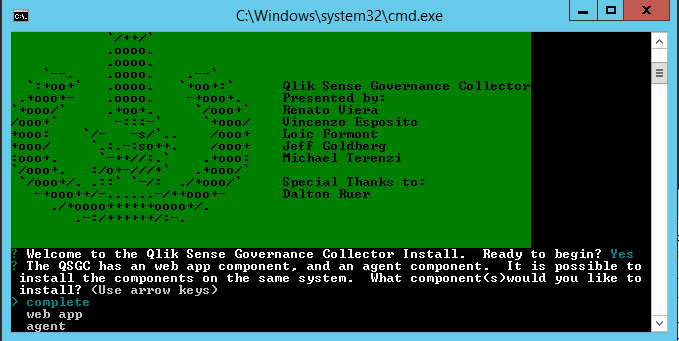

10. In order for the agent to communicate messages back to the web application, the port the web application runs on needs to be supplied to the agent install.  By default the web application port is **8591**.  If this is unchanged, press the enter key, otherwise enter the port number the web application will run on and press the enter key.    
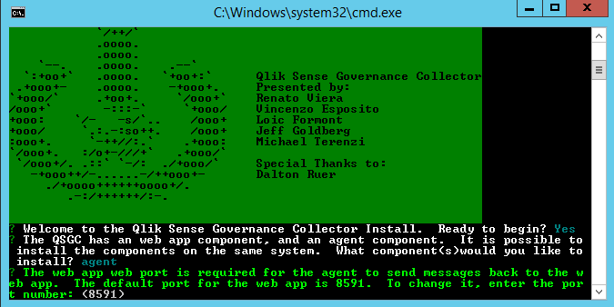

11. The agent listens on a different port than the web application.  The default port for the agent is **8592**.  If this is unchanged, press the enter key, otherwise enter the port number the agent will run on and press the enter key.    
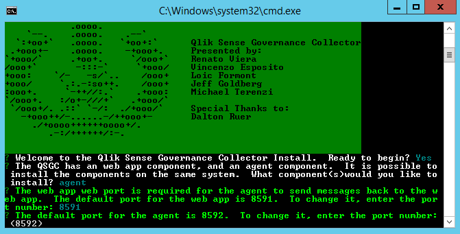

12. The next request from the installer is to identify the path where xml files output during metadata collection will be stored.  Enter a traditional windows path - *c:\metadata is the default* - or a unc path and press the enter key.   
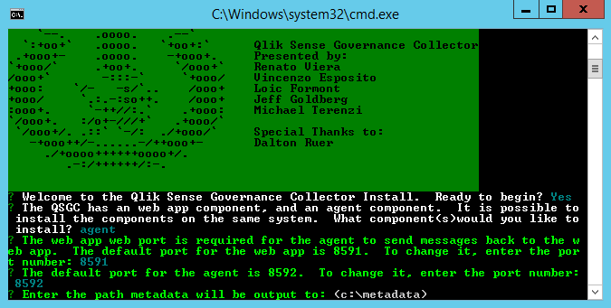

13. The next request from the installer is to identify the path where qvd files output during qvd generation will be stored.  Enter a traditional windows path - *c:\qvdOutput is the default* - or a unc path and press the enter key.   
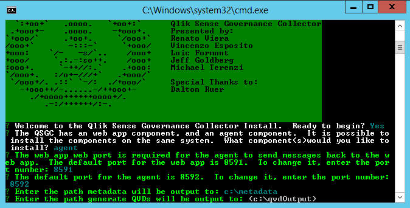

14. If the agent is being installed on a system with Qlik application script logs that will be processed, the next request from the installer is important to identify.  The path supplied here is for the xml files created during script log parsing.  Enter a traditional windows path - *\\share\parsedScriptLog is the default* - or a unc path and press the enter key.  We recommend the parsed script log folder be the same as the metadata folder.   

15. Now that the paths are specified for the agent, the installer asks if the paths should be created if they don't exist.  The default is *yes*.  Note that unc paths will not be created.  If unc paths are provided to the agent, those paths need to be created before running any governance collection processes on that system.    
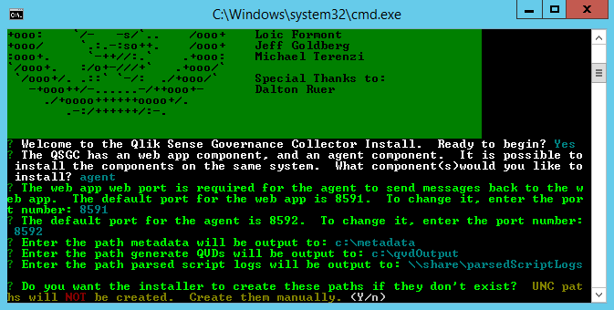

16. Confirm readiness for install.  The default is *yes*.   
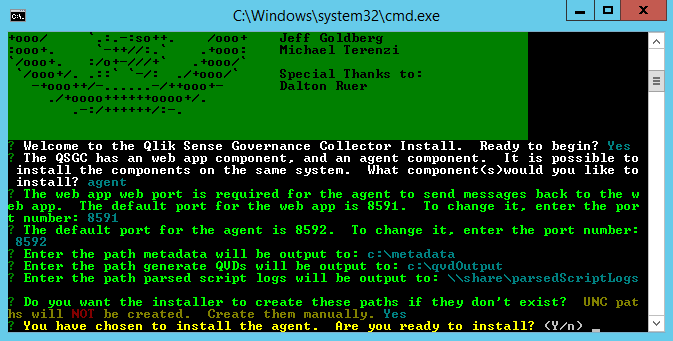

17. The installation process will commence.  Once complete, a message will appear at the bottom of the command prompt.    
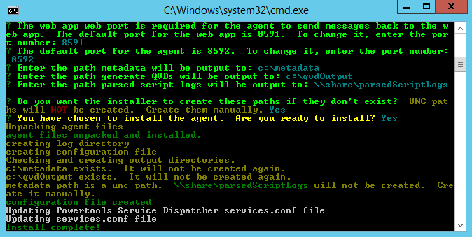

18. After seeing the install complete message, checks for the Powertools Service Dispatcher service reference in services will be made.  If the entry does not exist, it will be added automatically and the service will be started.  If the service exists, it will be started.  When prompted, press any key to close the command prompt window.    
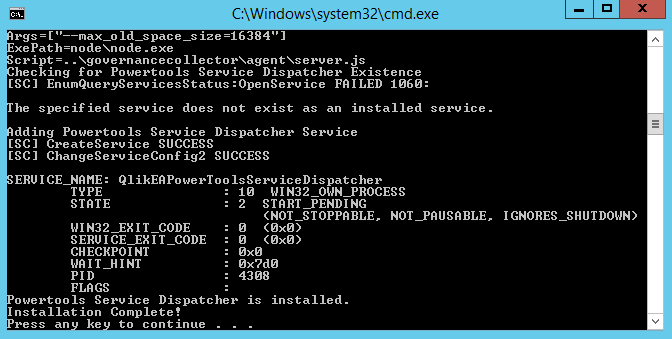

19. The finish dialog for the installation appears.  Click finish!    
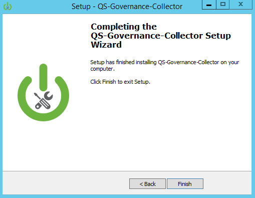

### Next Steps:
From where you installed the web application, enter **http://localhost:8591/governance/ui**